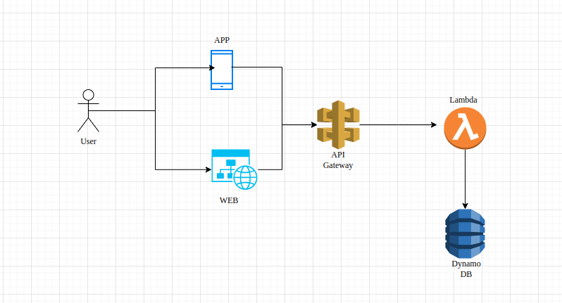

# Vehicle Service

This project is a RESTful API built in TypeScript, following Clean Architecture principles. The goal is to separate concerns, maintain testability, and create a scalable system by adhering to the SOLID principles.

## Table of Contents
- [Project Structure](#project-structure)
- [Technologies](#technologies)
- [Setup Instructions](#setup-instructions)
- [Running the Application](#running-the-application)
- [Clean Architecture Overview](#clean-architecture-overview)
  - [Domain Layer](#domain-layer)
  - [Application Layer](#application-layer)
  - [Infrastructure Layer](#infrastructure-layer)
  - [Main Layer](#main-layer)
- [Routes](#routes)
- [License](#license)

## Project Structure

The project follows the Clean Architecture pattern, where each layer has a well-defined responsibility:

```
__tests__/            # Unit, integration and e2e tests
src/
├── config/           # Application config.
├── domain/           # Business logic
│   ├── entities/     # Core business models
│   └── repositories/ # Abstract interfaces for data persistence
│── http/             # HTTP logic (express routes, middlewares)
│   ├── controllers
│   └── middlewares
│   └── routes
├── usecases/         # Coordinates between domain and infrastructure
│   ├── accounts/     # Business logic orchestration
│   ├── vehicles/     # Business logic orchestration
│   └── _dtos/        # Data transfer objects and validation
├── infrastructure/   # External frameworks (e.g., database)
│   └── repositories/ # Implementations of repository interfaces
├── utils/            # Utility functions and shared helpers  
├── app.ts            # Application entry points
├── lamda.ts          # Application entry points to lambda (server, routing)
├── server.ts         # Application entry points to run in containers (server, routing)
├── package.json      # Project metadata and dependencies
├── tsconfig.json     # TypeScript configuration
└── README.md         # Project documentation
```

## Technologies
- **TypeScript**: Type-safe JavaScript
- **Express**: Web framework
- **Node.js**: JavaScript runtime environment
- **Jest**: Testing framework

## Setup Instructions

To set up and run the API locally, follow these steps:

### 1. Clone the repository
```bash
git clone https://github.com/alefmreis/vehicle-service.git
cd vehicle-service
```

### 2. Set up environment variables
Create a `.env` file at the root of your project with the following configuration:
```
APP_ENV=dev
AWS_DYNAMO_DB_ACCESS_KEY=local
AWS_DYNAMO_DB_ACCESS_SECRET=local
AWS_DYNAMO_DB_ENDPOINT=http://localhost:8000
AWS_DYNAMO_DB_REGION=us-west-2
JWT_SECRET_KEY=jwy-key
LOG_LEVEL=info
PORT=3000
```

### 3. Start the local database using Docker
```bash
docker compose up -d dynamodb dynamodb-admin
```

This will start a local database using Docker, as configured in the `docker-compose.yml` file.

### 4. Install dependencies
```bash
npm install
```

### 5. Compile TypeScript
```bash
npx tsc
```

### 6. Create the application tables at DynamoDB

```bash
npm run script:dynamodb_tables
```
Remember to add the enviroment variables (DEFAULT_USER_EMAIL and DEFAULT_USER_PASSWORD) at the .env file before run the script

### 7. Create the application default account
```bash
npm run script:default_account
```

### 8. Start the application
```bash
npm run start
```

By default, the server will run on `http://localhost:3000`.

## Running the Application

### Development mode
To run the API in development mode with live reloads:
```bash
npm run dev
```

### Production mode
To build and run the application in production:
```bash
npm run build
npm start
```

## Clean Architecture Overview

This project follows Clean Architecture principles, ensuring a clear separation of concerns between different layers of the application.

### Domain Layer

The domain layer contains business logic. This is where **Entities**, **UseCases**, and **Repositories** reside.

- **Entities**: Represent core business models.
- **UseCases**: Define the business rules (what the app does).
- **Repositories**: Abstract interfaces for the infrastructure to implement (e.g., data persistence).

### Application Layer

The application layer coordinates the business logic. It contains **services** that orchestrate use cases and ensure data consistency. It also contains **DTOs** for data validation and transfer between layers.

### Infrastructure Layer

The infrastructure layer handles external services like databases, APIs, or the Express web framework.

- **Repositories**: Concrete implementations of domain-level repositories.
- **HTTP**: Express-specific logic for handling routes, controllers, and middlewares.

## Application Flow


## Routes

### Accounts

#### `POST /api/v1/accounts`

Creates a new account.

- **Request Headers**:
  - `Authorization`: `Bearer <token>`

- **Request Body** (JSON):
  ```json
  {
    "name": "Alef",
    "email": "john.test@ccompany.com",
    "isAdmin": true,
    "password": "12345678"
  }
  ```

- **Response**:
  - `201 Created`: Account created successfully.
  - `401 Unauthorized`: Invalid credentials.
  - `409 Conflict`: Already existent account.
  - `422 Unprocessable Entity`: Invalid input.
  

#### `POST /api/v1/accounts/login`

Logs in to the system and returns a JWT token.

- **Request Body** (JSON):
  ```json
  {
    "email": "john.test@ccompany.com",
    "password": "12345678"
  }
  ```

- **Response**:
  - `200 OK`: Successful login with JWT token.
  - `401 Unauthorized`: Invalid credentials.

#### `POST /api/v1/accounts/reset-password`

Resets the password for an account.

- **Request Headers**:
  - `Authorization`: `Bearer <token>`

- **Request Body** (JSON):
  ```json
  {
    "email": "john.test@ccompany.com",
    "password": "12345678"
  }
  ```

- **Response**:
  - `200 OK`: Password reset successfully.
  - `401 Unauthorized`: Invalid credentials.
  - `404 Not Found`: Invalid account.
  - `422 Unprocessable Entity`: Invalid input.

### Vehicles

#### `GET /api/v1/vehicles?limit=10&page_token=123`

Fetches a list of vehicles, limited to 10 results.

- **Request Headers**:
  - `Authorization`: `Bearer <token>`

- **Response**:
  - `200 OK`: Returns a list of vehicles.
  - `401 Unauthorized`: Invalid or missing token.

#### `POST /api/v1/vehicles`

Creates a new vehicle entry.

- **Request Headers**:
  - `Authorization`: `Bearer <token>`

- **Request Body** (JSON):
  ```json
  {
    "name": "Onix 1.6",
    "brand": "GM",
    "model": "Plus"
  }
  ```

- **Response**:
  - `201 Created`: Vehicle created successfully.
  - `401 Unauthorized`: Invalid or missing token.
  - `422 Unprocessable Entity`: Invalid input.

#### `PUT /api/v1/vehicles/:id`

Updates an existing vehicle by ID.

- **Request Headers**:
  - `Authorization`: `Bearer <token>`

- **Request Body** (JSON):
  ```json
  {
    "name": "Onix 1.4",
    "brand": "GM",
    "model": "Plus SZ"
  }
  ```

- **Response**:
  - `200 OK`: Vehicle updated successfully.
  - `401 Unauthorized`: Invalid or missing token.
  - `404 Not Found`: Vehicle not found.
  - `422 Unprocessable Entity`: Invalid input.

#### `GET /api/v1/vehicles/:id`

Fetches details of a specific vehicle by ID.

- **Request Headers**:
  - `Authorization`: `Bearer <token>`

- **Response**:
  - `200 OK`: Returns vehicle details.
  - `401 Unauthorized`: Invalid or missing token.
  - `404 Not Found`: Vehicle not found.

#### `DELETE /api/v1/vehicles/:id`

Deletes a specific vehicle by ID.

- **Request Headers**:
  - `Authorization`: `Bearer <token>`

- **Response**:
  - `204 No Content`: Vehicle deleted successfully.
  - `401 Unauthorized`: Invalid or missing token.
  - `404 Not Found`: Vehicle not found.
